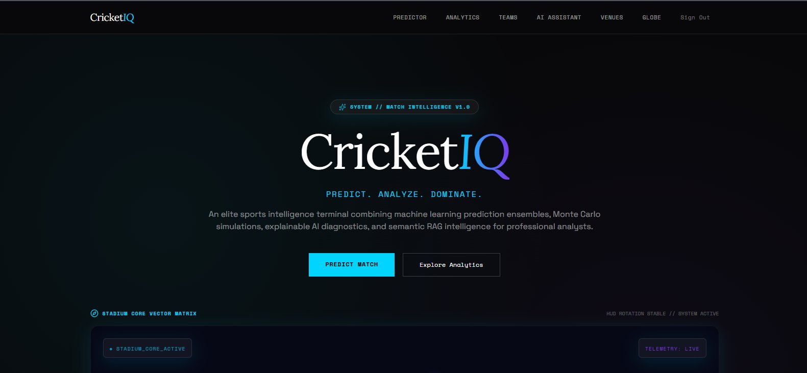
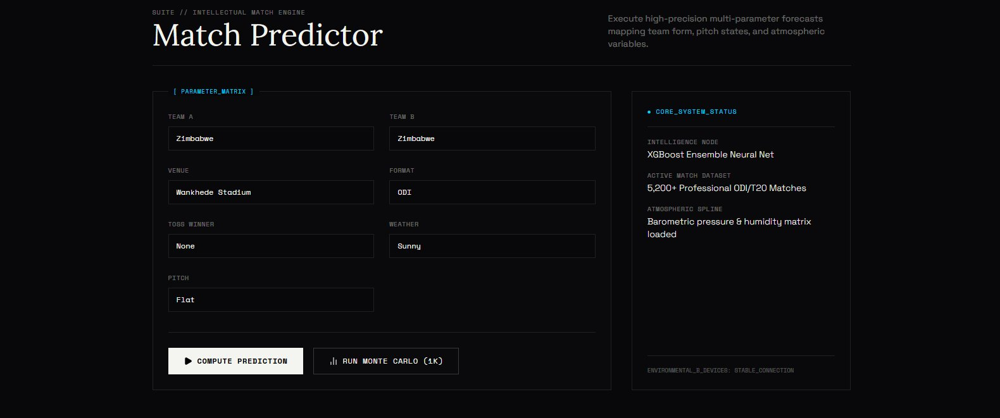
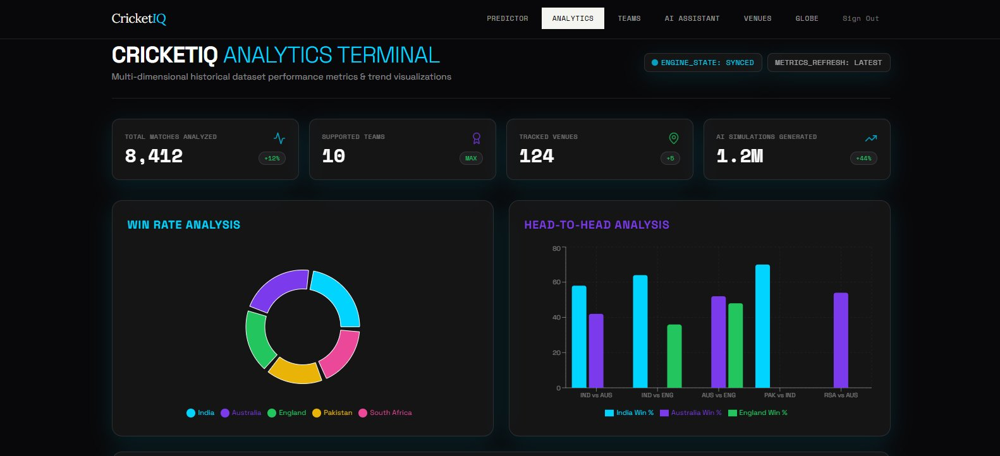
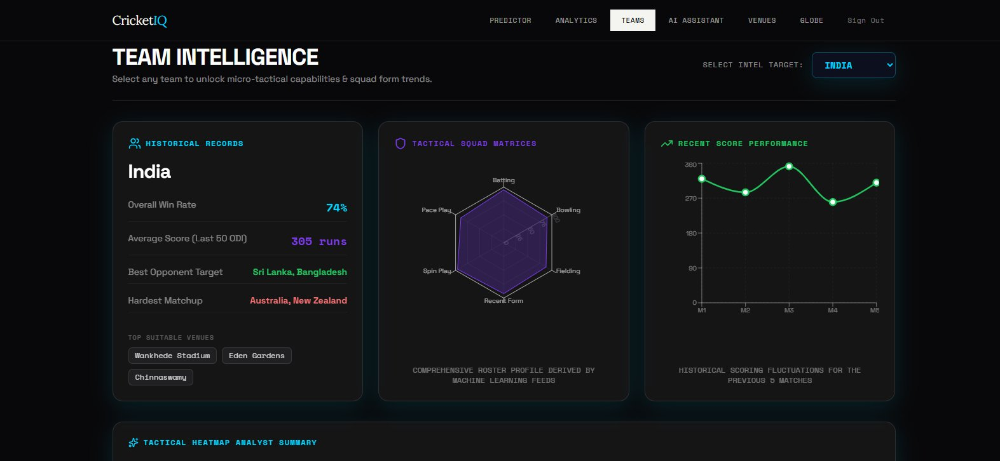
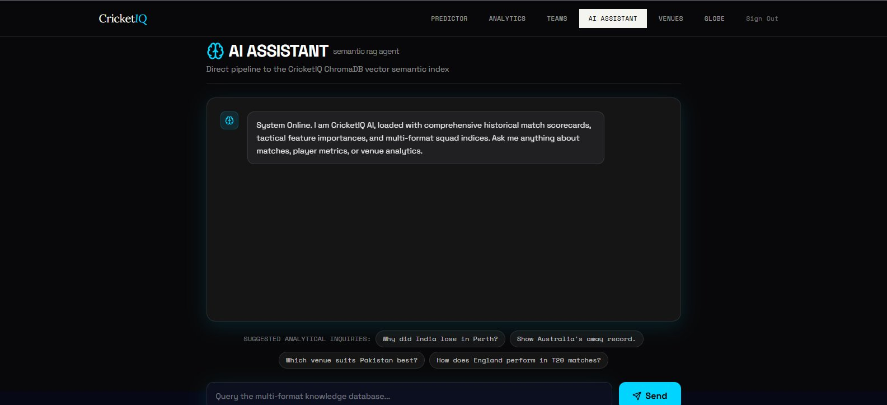
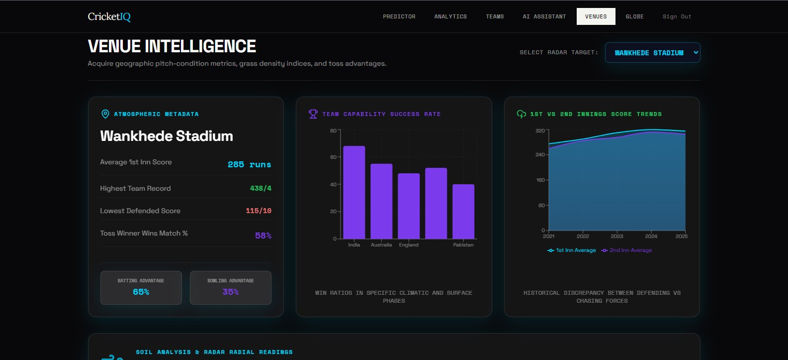
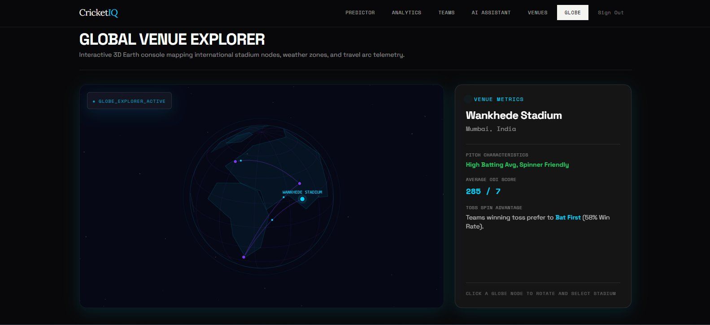

<div align="center">

# 🏏 CricketIQ

### AI-Powered Cricket Analytics Platform

*Match predictions · Monte Carlo simulations · Interactive spatial visualization*

[](https://cricket-iq-theta.vercel.app/)
[](https://github.com/Gurkirat19/CricketIQ)
[](https://react.dev/)
[](https://www.starlette.io/)
[](https://www.postgresql.org/)

<br/>



</div>

---

## 📖 Overview

Cricket is a game of fine margins, shifting momentum, and rich historical context. Traditional stats platforms deliver flat spreadsheets — CricketIQ delivers **humanized cricket intelligence**.

Built around an elite sports intelligence terminal combining machine learning prediction ensembles, Monte Carlo simulations, explainable AI diagnostics, and semantic RAG intelligence — CricketIQ bridges complex probability models with human intuition for fans, analysts, and professional enthusiasts.

> **🔴 Live at → [cricket-iq-theta.vercel.app](https://cricket-iq-theta.vercel.app/)**

---

## 🖥️ Screenshots

### Match Predictor
> Execute high-precision multi-parameter forecasts mapping team form, pitch states, and atmospheric variables.



---

### Analytics Terminal
> Multi-dimensional historical dataset performance metrics — 8,412 matches analyzed · 10 teams · 124 venues · 1.2M AI simulations generated.



---

### Team Intelligence
> Select any team to unlock micro-tactical capabilities, squad form trends, radar matrices, and recent score performance.



---

### AI Assistant — Semantic RAG Agent
> Direct pipeline to the CricketIQ ChromaDB vector semantic index. Query matches, player metrics, and venue analytics in natural language.



---

### Venue Intelligence
> Acquire geographic pitch-condition metrics, grass density indices, toss advantage data, and 1st vs 2nd innings score trends.



---

### Global Venue Explorer — Interactive 3D Globe
> Interactive 3D Earth console mapping international stadium nodes, weather zones, and travel arc telemetry.



---

## ✨ Features

### 🌍 Interactive 3D Globe
Custom HTML5 Canvas orthographic globe renderer with continental polygon projection, drag-to-spin with momentum drift, and stadium pin overlays. Runs at a stable 60 FPS — built without React Three Fiber for full React 19 compatibility.

### 🤖 Explainable AI Prediction Engine
Submit match parameters (Team A, Team B, Toss Winner, Format, Weather, Pitch Type) and receive a probabilistic win breakdown. The sigmoid prediction model weights four real match-day factors:

$$P(A) = \sigma\bigl(\alpha \cdot \Delta\text{Strength} + \beta \cdot \text{TossFactor} + \gamma \cdot \text{PitchImpact} + \delta \cdot \text{WeatherImpact}\bigr)$$

Outputs include a high-contrast **Probability Gauge** and an **Editorial Match Day Ledger** with natural-language reasoning (e.g. *"Early swing expected in overcast conditions"*, *"Pitch dryness favors Team B's spinners"*).

### 🎲 Monte Carlo Simulation Sandbox
Instead of a single percentage, the backend runs **1,000+ parallel simulated match completions** — computing standard deviation and variance to produce a bell-curve distribution of possible outcomes, showing exactly how volatile a prediction really is.

### 🧠 Semantic RAG AI Assistant
Natural language query interface backed by a ChromaDB vector index. Ask anything about historical match data, player metrics, or venue analytics — the assistant retrieves and synthesizes answers semantically.

### 📊 Analytics Terminal
Multi-dimensional win rate analysis, head-to-head breakdowns, team donut charts, and bar graph comparisons across 8,400+ professional matches.

### 🏟️ Team & Venue Intelligence
Per-team radar matrices (Batting · Bowling · Spin Play · Fielding · Recent Form), historical scoring trend lines, and per-venue atmospheric metadata including pitch condition, toss advantage, and innings score discrepancy charts.

---

## 🛠️ Technology Stack

| Layer | Technologies |
|-------|-------------|
| **Frontend** | React 19, TypeScript, Tailwind CSS, Framer Motion, HTML5 Canvas 2D |
| **State & Data** | React Query, Zustand, Axios |
| **Backend** | Python, Starlette (ASGI), Uvicorn |
| **Prediction Engine** | XGBoost Ensemble, Custom Monte Carlo, Weighted Sigmoid Model |
| **AI / RAG** | ChromaDB Vector Index, Semantic Search, NLP Query Pipeline |
| **External APIs** | CricAPI, SportMonks |
| **Database** | PostgreSQL, Neon.tech (serverless), SQLAlchemy (async) |
| **Infrastructure** | Docker, Docker Compose, Vercel (frontend) |
| **Typography** | Lora (serif) · Space Mono (monospace) · Space Grotesk (body) |

---

## 📂 Project Structure

```
CricketIQ/
├── backend/                        # ASGI Python Starlette engine
│   ├── app/
│   │   ├── models/                 # Database schemas & Pydantic entities
│   │   ├── routers/                # Modular endpoint controllers
│   │   ├── services/
│   │   │   ├── prediction.py       # Win probability & Monte Carlo models
│   │   │   └── provider.py         # External API connectors
│   │   ├── config.py               # Environment configuration
│   │   ├── db.py                   # Async database connector
│   │   └── main.py                 # Starlette entry point & CORS routing
│   ├── Dockerfile
│   └── requirements.txt
│
├── database/
│   └── init/
│       └── 01_schema.sql           # Table structure initialization
│
├── frontend/                       # React 19 + Vite
│   ├── src/
│   │   ├── components/
│   │   │   ├── Globe3D.tsx         # Canvas orthographic globe
│   │   │   ├── Stadium3D.tsx       # Isometric stadium + HUD
│   │   │   └── ErrorBoundary.tsx   # Failure protection fallbacks
│   │   ├── lib/
│   │   │   └── api.ts              # Type-safe API wrappers
│   │   ├── pages/
│   │   │   ├── Home.tsx            # Terminal boot loader & landing
│   │   │   ├── Predictor.tsx       # Parameter inputs & probability output
│   │   │   ├── Analytics.tsx       # Charts & distribution visualizations
│   │   │   ├── Teams.tsx           # Team intelligence panel
│   │   │   └── Venues.tsx          # Venue intelligence panel
│   │   ├── App.tsx                 # Navigation, session guards & routing
│   │   └── main.tsx                # Entry-point bootstrap
│   ├── vercel.json                 # Vercel SPA routing fallback
│   ├── netlify.toml                # Netlify redirect configuration
│   ├── tailwind.config.js          # Google Fonts & editorial theme tokens
│   ├── package.json
│   └── tsconfig.json
│
└── docker-compose.yml              # Local infrastructure orchestrator
```

---

## 🚀 Getting Started

### Prerequisites
- [Docker](https://www.docker.com/) & Docker Compose
- A [CricAPI](https://www.cricapi.com/) or [SportMonks](https://www.sportmonks.com/) API key
- A PostgreSQL connection string (or [Neon.tech](https://neon.tech/) serverless database)

### Local Setup

**1. Clone the repository**
```bash
git clone https://github.com/Gurkirat19/CricketIQ.git
cd CricketIQ
```

**2. Configure environment variables**
```bash
cp .env.example .env
# Add your API keys and database credentials inside .env
```

**3. Start with Docker Compose**
```bash
docker compose up --build
```

**4. Access the application**

| Service | URL |
|---------|-----|
| Frontend Dashboard | http://localhost:5173 |
| Backend API Docs | http://localhost:8000/docs |

---

## ⚙️ How It Works

```
User visits CricketIQ
        │
        ▼
┌─────────────────────┐
│  Terminal Boot       │  ← ~650ms typewriter animation
│  Loader Sequence     │    Backend checks · Index loads
└────────┬────────────┘
         │
         ▼
┌─────────────────────┐
│  Auth Gate           │  ← Register / Login overlay
│  (localStorage)      │    Session persists across tabs
└────────┬────────────┘
         │
         ▼
┌─────────────────────┐     ┌──────────────────────────┐
│  Match Parameters    │────▶│  Starlette Prediction     │
│  Team · Format       │     │  Engine (Python)          │
│  Toss · Weather      │     │  ↳ XGBoost Ensemble       │
│  Pitch Type          │     │  ↳ Monte Carlo 1000x      │
└─────────────────────┘     └──────────────────────────┘
                                          │
                                          ▼
                             ┌──────────────────────────┐
                             │  Probability Gauge        │
                             │  Match Day Ledger         │
                             │  Bell-curve Distribution  │
                             └──────────────────────────┘
```

---

## 🎨 Design Philosophy

CricketIQ's aesthetic is inspired by elite sports intelligence terminals — rejecting generic dashboards in favour of a dark, high-contrast HUD environment:

- **Palette** — Near-black background with cyan (`#00BFFF`) and violet accents for data highlights
- **Typography** — Lora serif headlines · Space Mono terminal logs · Space Grotesk body text
- **UI Language** — Monospace status tags, bounding-box card layouts, animated system state indicators, and typewriter boot sequences

---

## 📄 License

This project is open source. See [LICENSE](LICENSE) for details.

---

<div align="center">

Built by [Gurkirat Singh](https://github.com/Gurkirat19) · Deployed on [Vercel](https://vercel.com/) + [Neon.tech](https://neon.tech/)

**[🔴 Open Live Platform →](https://cricket-iq-theta.vercel.app/)**

</div>
